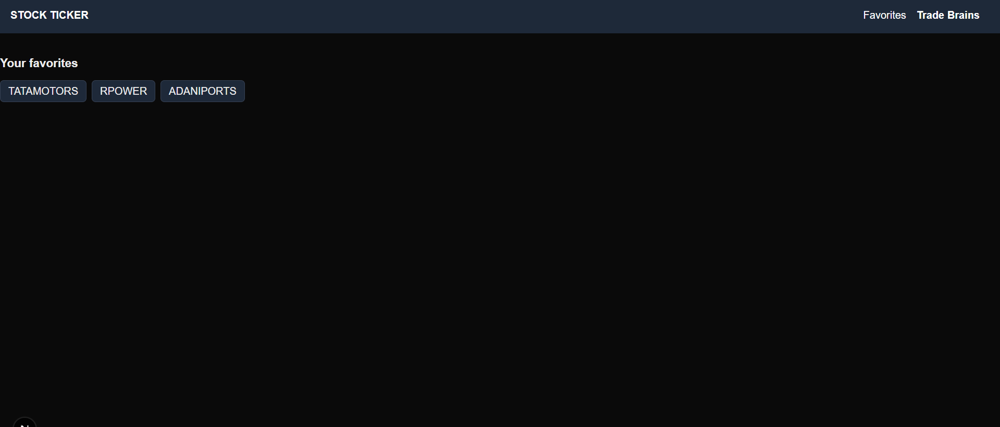

# 📈 Stock Ticker Application

A **Next.js** application that allows users to search for stocks, view detailed information, and visualize stock price data over time.  
Developed as part of the **TradeBrains Web Developer Assessment**.

---

## 🚀 Features

- **Stock Search with Autocomplete**  
  Search for stocks using the provided API with instant suggestions as you type.

- **Dynamic Stock Details Page**  
  Displays:
  - Stock name & symbol
  - Latest price graph (30-day daily data)
  - Proper **SEO meta tags** for improved search indexing

- **Interactive Stock Graph**  
  Uses **Recharts** to display stock price history.

- **Favorites Management**  
  Save your favorite stocks to **localStorage** and access them quickly.

- **Error Handling**  
  User-friendly error messages when stock data is unavailable.

---

## 📷 Screenshots

### Home Page with Search


### Stock Details Page


### Favorite Stocks Page


---

## 🛠️ Tech Stack

- **Frontend Framework**: [Next.js](https://nextjs.org/) (React)
- **Styling**: [Tailwind CSS](https://tailwindcss.com/)
- **Charts**: [Recharts](https://recharts.org/)
- **Data Fetching**: Next.js server components with `fetch`
- **API**: TradeBrains Stock APIs

---

## 🔌 APIs Used

- **Search API**  

GET /api/assignment/search?keyword={KEYWORD}&length=10

- **Stock Prices API**

GET /api/assignment/stock/{SYMBOL}/prices?days=30&type=DAILY&limit=100&format=json

---

## ⚙️ Installation & Running Locally

1. **Clone the repository**
   ```bash
   git clone https://github.com/Priyanshu-010/Stock-Ticker
   cd stock-ticker-app

2. **Install dependencies**
   npm install

3. **Run the development server**
   npm run dev

4.  **Open in browser**
   http://localhost:3000
   

---

📌 Additional Notes

The app is fully responsive and works across devices.

Data is fetched in real-time with cache: "no-store" to ensure freshness.

Favorite stocks are stored locally; clearing browser storage will remove them.

---

## ✍️ Author

**Priyanshu Rai**

📧 Email: priyanshurai2772@gmail.com  
🔗 LinkedIn: https://www.linkedin.com/in/priyanshuraidev/  
💻 GitHub: https://github.com/Priyanshu-010

